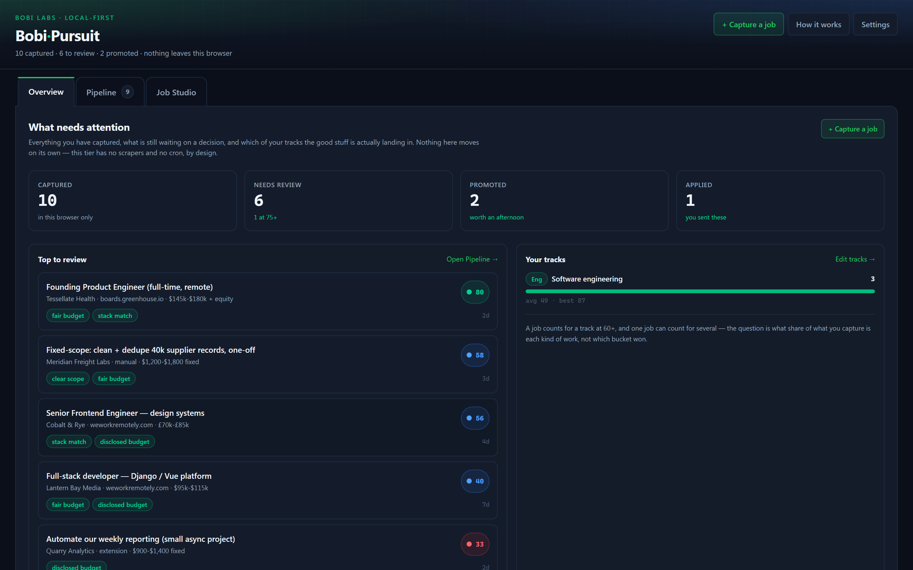
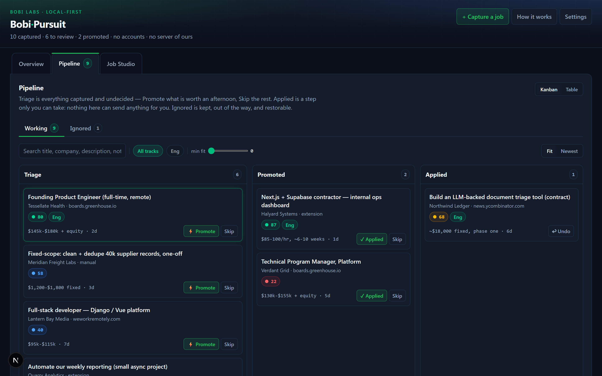
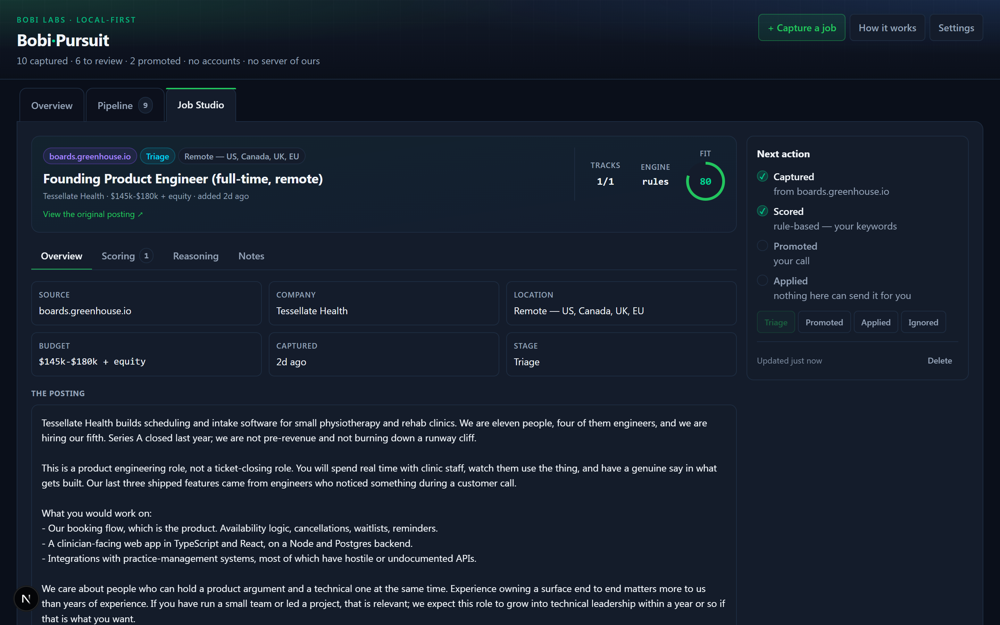

<div align="center">

# Bobi·Pursuit

**A local-first job pipeline.** Capture postings from anywhere, triage them on a
board, and score them against *your* profile instead of reading every one.

[](./LICENSE)
[](https://nextjs.org)
[](#your-data)
[](#your-data)

### [→ Try it now](https://pursuit.bobilabs.dev)

No account. No server. No database. Nothing to sign up for.



</div>

---

## Why this exists

Job boards are optimised for volume, not for you. A search that matches your
stack returns four hundred results, of which maybe six are worth an hour of your
time, and you find those six by opening tabs until you lose track of which ones
you have already read.

The tedious part of a job hunt is not applying. It is the triage: re-reading the
same posting three times because it surfaced on three sites, re-deciding things
you already decided, and losing a genuinely good role in a pile of near-misses.

Bobi·Pursuit does the boring half:

- **Capture** — one click from any job page, wherever you found it.
- **Deduplicate** — the same posting from three sources is one card.
- **Score** — against a profile you write, with the reasoning shown.
- **Triage** — a board with clear columns and no ceremony.

It does not apply for you, write your cover letters, or email anyone. You stay
in the loop for everything that matters.

---

## What it looks like

**Triage board.** Promote what is worth an afternoon, skip the rest. Nothing
moves on its own.



**One job, in full.** The score, which track earned it, the flags that moved it,
and the posting itself.



---

## Three ways to run it

| | What you get | What it costs | What you need |
|---|---|---|---|
| **Free / local** — this repo | Capture, dedupe, kanban triage, rule-based scoring, export/import | Nothing | A browser |
| **Bring your own key** — this repo | Everything above, plus LLM scoring that reads a posting properly instead of matching keywords | Your own API usage, typically cents per hundred jobs | An Anthropic API key, stored in your browser and sent only to Anthropic |
| **Self-host** — *not in this repo* | Everything above, plus scheduled scrapers, cron polling, and a database shared across devices | Hosting, plus API usage | A server, a database, and the hosted edition |

**The first two rows are what this repository is**, and they are a complete
product rather than a demo. The third row describes the hosted edition, which is
a different codebase and is not included here; it is listed so the boundary is
obvious rather than discovered.

---

## Quickstart

Requires **Node 20.9+** and **pnpm**.

```bash
pnpm install
pnpm dev            # http://localhost:3000
```

To build a static copy you can keep:

```bash
pnpm build          # writes a static site to out/
```

### Hosting the static build

`out/` is plain files with no server behind them, but its asset paths are
root-absolute (`/_next/...`), which decides where it can be served from:

| | Works | Why |
|---|---|---|
| A domain root (`example.com`) | ✅ | What the app is built for |
| `npx serve out` | ✅ | Serves at `/` |
| GitHub Pages **user or org** site, or any custom domain | ✅ | Also a root |
| GitHub Pages **project** site (`user.github.io/repo/`) | ❌ | Assets resolve to `/_next/...`, one level above your app |
| Opening `out/index.html` from disk (`file://`) | ❌ | `/_next/...` resolves to your filesystem root |

To serve from a sub-path, set a `basePath` in `next.config.mjs` and rebuild.
Nothing else in the app needs to change.

---

## Capture

Getting a job into the pipeline should take one click from the page you are
already reading. Two routes do that, and both speak the same URL format:

```
/?add=1&t=<title>&u=<url>&d=<description>&b=<budget>&s=<source>
```

Opening a link like that pre-fills the add-job form. You review it and confirm.
Nothing is saved behind your back.

### Bookmarklet (works everywhere, no install)

Create a bookmark whose URL is the line below, replacing `APP_URL` with wherever
you are running the app:

```js
javascript:(function(){var s=(window.getSelection?String(window.getSelection()):'').slice(0,11000);var q=new URLSearchParams({add:'1',t:document.title.slice(0,300),u:location.href,d:s,s:location.hostname});window.open('APP_URL/?'+q.toString(),'_blank');})();
```

On a job page, **select the description text** and click the bookmark. The
selection becomes the description; without a selection you still get the title
and URL and can paste the rest.

### Browser extension

A **Chrome and Firefox** extension captures without the select-and-click step:
it reads the job description out of the page directly, using per-site selectors
for the common boards, and falls back to your selection when a site is
unfamiliar. It sends the same parameters to the same URL.

Install it from the store for your browser:

- **Chrome, Edge, Brave, Arc** — <https://chromewebstore.google.com/detail/imeiijihiifnfdancfojmelbnfpmfllb>
- **Firefox** — <https://addons.mozilla.org/en-US/firefox/addon/bobi-pursuit-capture/>

Source is in
[`extension/`](https://github.com/Bobi-Labs/bobi-pursuit/tree/main/extension).
It is MIT too, it defaults to this free app with no account, and it reads a page
only when you click. (Absolute URL on purpose: this README is the root README of
the public repo but lives one level down in the private tree, so a relative link
would be correct in exactly one of the two places.)

Capture is always explicit. Nothing is read from a page until you click.

---

## Your data

Everything is stored in your browser's `localStorage` under a single key. That
has one obvious consequence worth stating plainly: **clearing your browser data
deletes your pipeline.** Export regularly.

- **Export** writes a JSON file containing your settings and every job. It is
  plain, readable JSON with a schema version, not an opaque blob.
- **Import** reads that file back, on any machine, in any browser.
- **An API key is never exported.** If you have set one, it is stripped from the
  export, so you can share or back up the file without leaking a credential.

There is no telemetry, no analytics, and no network request to us, because there
is no us to request anything from.

That promise is **enforced, not just stated**. The deployed app ships a
Content-Security-Policy of:

```
connect-src 'self' https://api.anthropic.com
```

The browser then refuses any outbound request to anywhere else, including from
code you did not write. With no API key set, the app has nowhere to talk to at
all. With one set, the single permitted destination is Anthropic, and only
because you asked for it. If you host this yourself, that policy lives in
[`vercel.json`](./vercel.json). Keep it.

---

## How scoring works

A job is scored against **your tracks**, up to five of them, because most people
are running more than one search at once and a single number hides that.

A track is something you define:

| Field | What it does |
|---|---|
| **Name** | What you call this search — "Contract React work", "Senior product roles" |
| **Description** | Plain English: the work you actually want. This is what a model reads |
| **Keywords** | The words that signal it. Hits in a job *title* count double |
| **Exclusions** | Deal-breakers for this track specifically |

Onboarding offers eight editable presets, so you are not staring at an empty
box. Edit them; they are yours.

Each track gets its own fit score and its own reasoning. The headline number on
a card is the **best** of them, and the card shows which track earned it. A job
can be a poor contract but an excellent micro gig, and you want to see that
rather than average it away into "62".

Scores also carry **red flags** and **green flags**, the specific things that
moved the number.

### Rules, or a model

Without a key, scoring is a set of rules matching your **keywords**. That is
inspectable, instant, free, and it never sends anything anywhere. It is also a
keyword matcher, so it will sometimes rate a genuinely good job as mediocre
because the posting used different words than you did.

Add an Anthropic API key and the same tracks are judged by a model that reads
your **description** and the posting in full, then writes its own reasoning for
each track. That is the real difference between the two tiers, and it is why the
description field is worth writing properly.

Scores are advice, not verdicts. Re-scoring is one click after you change
anything.

---

## What the free tier deliberately cannot do

Two things, and both are real limits rather than upsells.

**It cannot scrape job boards.** Not "does not yet" — cannot. Client-side
scraping is blocked twice over: browsers refuse cross-origin requests unless the
target site opts in, and job boards do not opt in. Even routing around that,
every large board blocks datacenter IP ranges, so a hosted scraper gets a 403
where your own browser gets a page. This is why capture exists and why it is
built around one deliberate click.

**It cannot use an LLM without a key.** The built-in scorer is rules over
keywords, rates and locations. It is genuinely useful and it is honest about
being a heuristic. Supplying your own API key upgrades scoring to a model that
reads the posting; there is no free tier of somebody else's inference.

Also absent by design: no accounts, no sync between devices, no proposal or
cover-letter generation, and no application tracking beyond the board itself.

---

## Development

```bash
pnpm dev            # dev server
pnpm build          # static export to out/
pnpm typecheck      # tsc --noEmit
```

Next.js with `output: 'export'`, React and Tailwind. No other runtime
dependencies, deliberately: the whole point is a thing that still builds in
three years.

One constraint worth knowing before contributing: **a static export still
prerenders on the server.** Nothing may touch `localStorage`, `window` or
`document` during render. Storage is loaded in an effect, and the store exposes
a frozen empty document as its server snapshot.

---

## License

**MIT** — see [LICENSE](./LICENSE). Fork it, ship it, sell it.

The licence covers the code only. The names and branding are not licensed with
it — see [TRADEMARK.md](./TRADEMARK.md). Please ship your fork under your own name.

Built by [Bobi Labs](https://bobilabs.dev).
